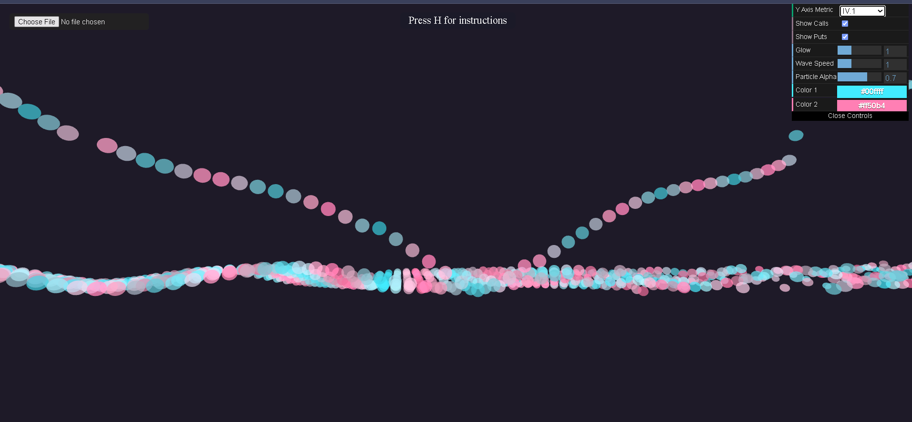

# 🌌 Option Particle Ocean 🌊

**Dive into a mesmerizing 3D visualization of SPY option chain data!**

Option Particle Ocean transforms complex financial data into an interactive, neon-glowing universe of particles. Explore expiration dates, strike prices, and key metrics like Ask, Implied Volatility, and Volume in a stunning and intuitive way.



---

## ✨ Features

*   **Full 3D Immersion:** Navigate a dynamic particle grid using mouse orbit controls and keyboard flight (WASD, Arrows, Q/E, Shift for speed boost!).
*   **Dynamic Data Mapping:**
    *   **X-axis:** Expiration Date
    *   **Z-axis:** Strike Price
    *   **Y-axis & Color:** User-selectable metric (Ask, IV, Volume, Delta, Gamma for Calls & Puts).
*   **Interactive GUI:**
    *   Easily switch the Y-axis metric.
    *   Toggle visibility for Call and Put options.
    *   Adjust visual parameters like particle glow, wave speed, alpha, and color gradients.
*   **Hover Tooltips:** Get instant insights! Hover over any particle to see its specific Expiration, Strike, and current Y-axis metric value.
*   **Custom CSV Upload:** Bring your own data! Upload a `spy_quotedata.csv` (formatted with headers on row 3, data from row 4) and watch the ocean reshape.
*   **User-Friendly Onboarding:**
    *   Elegant title display on load.
    *   "Press H for Instructions" hint.
    *   Comprehensive instructions modal detailing all controls and features.
*   **Built with Three.js:** Leverages the power of Three.js for smooth 3D rendering and interactions.

---

## 🚀 Getting Started

**Live Demo:**
*(Link to your Netlify deployment will go here! Example: [https://your-option-ocean.netlify.app](https://your-option-ocean.netlify.app))*

**Running Locally:**

1.  Clone this repository:
    ```bash
    git clone [URL_OF_YOUR_GITHUB_REPO]
    ```
2.  Navigate to the project directory:
    ```bash
    cd [YOUR_REPO_NAME]
    ```
3.  Ensure you have the necessary local JavaScript libraries (`three.js`, `OrbitControls.js`) in the `quantumoptions/js/` directory as referenced by `neon_option_ocean.html`.
4.  Open `neon_option_ocean.html` in your web browser.
    *   *Note: Some browsers might have security restrictions (CORS) when loading the `spy_quotedata.csv` or `instructions.js` directly from the file system. Running a simple local HTTP server is recommended for full functionality.*
        *   For example, using Python: `python -m http.server` (Python 3) or `python -m SimpleHTTPServer` (Python 2) in the project directory, then navigate to `http://localhost:8000/neon_option_ocean.html`.

---

## 🛠️ How to Use

*   **Navigate:**
    *   **Mouse:** Click and drag to orbit. Scroll wheel to zoom.
    *   **Keyboard:**
        *   `W` / `S`: Move Forward / Backward
        *   `A` / `D`: Strafe Left / Right
        *   `Arrow Up` / `Arrow Down`: Move Camera Up / Down
        *   `Arrow Left` / `Arrow Right`: Rotate Camera Left / Right
        *   `Q` / `E`: Rotate Camera Left / Right
        *   `Shift`: Hold for a speed boost.
*   **Interact:**
    *   Use the **GUI controls** (top right, usually) to change the displayed metric, toggle calls/puts, and adjust visual effects.
    *   **Hover** over particles for detailed data.
    *   Press `H` to toggle the **instructions panel**.
    *   Click the **"Choose File" button** (top left) to upload your own CSV data.

---

## 📁 File Structure

*   `neon_option_ocean.html`: The main HTML file.
*   `neon_option_ocean.js`: Core Three.js application logic.
*   `instructions.js`: Content for the help modal.
*   `spy_quotedata.csv`: Default sample option data.
*   `quantumoptions/js/`: Directory for local copies of `three.js` and `OrbitControls.js`.
*   `README.md`: This file!

---

## 🙏 Credits & Acknowledgements

*   Built with [Three.js](https://threejs.org/) and [dat.GUI](https://github.com/dataarts/dat.gui).
*   Inspired by the need for more intuitive financial data visualizations.
*   By Leslie Cuadra, built with Cursor IDE.

---

Happy data exploring! 🌊✨ 
